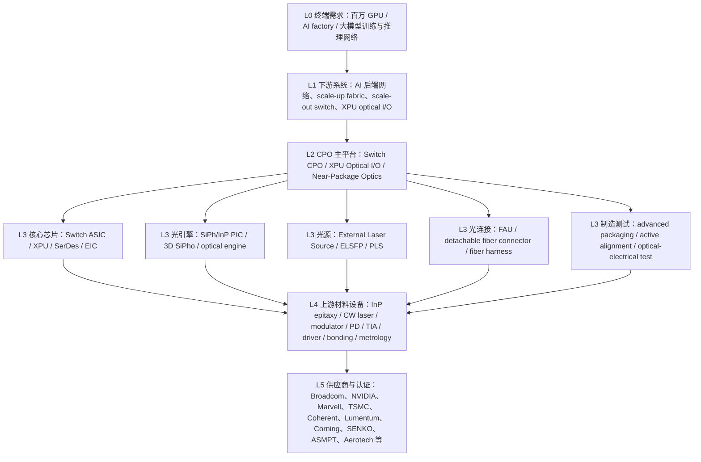

# CPO 及上游细分环节逐层拆解

日期：2026-06-01

## 结论先行

CPO（Co-Packaged Optics，共封装光学）不是一个单独“光模块”，而是一种系统架构：把光引擎放到交换 ASIC、XPU/GPU 或互连芯片附近，缩短高速电信号路径，用光纤把数据引出。它要解决的是 1.6T/3.2T 以后传统 pluggable 光模块、长 PCB 走线、retimer/DSP 和前面板 I/O 在功耗、带宽密度、可靠性和布线上的瓶颈。

按投资和产业链拆解，CPO 要分成三条主线：

1. `Switch CPO`：交换 ASIC + CPO 光引擎，代表方向是 NVIDIA Spectrum-X/Quantum-X Photonics、Broadcom Tomahawk/Bailly/Davisson。
2. `XPU Optical I/O`：GPU/XPU/ASIC package 直接集成光 I/O，代表方向是 Marvell 3D SiPho Engine、Ayar Labs TeraPHY、Lightmatter Passage。
3. `CPO 上游硬件生态`：外置光源 ELS、硅光/InP PIC、FAU/可拆光连接、主动对准/封装测试、热管理、先进封装、标准接口和 FAE/认证。

当前 2026 年的判断：CPO 已经从 demo 进入早期产品和平台验证，但还不是 800G/1.6T pluggable 光模块的全面替代。未来 6-24 个月最值得跟踪的上游约束不是普通光纤或普通连接器，而是：

- `External laser source / ELSFP / 高功率 CW laser`
- `CPO 光引擎 / 200G/lane SiPh/InP PIC`
- `FAU / detachable fiber connector / fiber-to-chip coupling`
- `CPO active alignment / precision bonding / wafer-die-system test`
- `CPO 热管理、ELS 供电和可维护性结构`

## CPO 到底在系统里替代什么

传统 pluggable 架构：

`Switch ASIC -> PCB 长走线 -> retimer/DSP/driver -> 前面板光模块 -> 光纤`

CPO 架构：

`Switch ASIC / XPU -> package 内或近封装短电连接 -> optical engine / PIC -> FAU / detachable connector -> 光纤`

它主要替代：

| 被替代或减少的环节 | CPO 怎么改变它 | 投研含义 |
| --- | --- | --- |
| ASIC 到前面板光模块的长电通道 | 光引擎靠近 ASIC，电路径大幅缩短 | 对传统板上 retimer、长 PCB 走线和部分高功耗 DSP 不利 |
| 可插拔光模块的完整盒子形态 | 光引擎从前面板模块转移到 package/near-package | 光模块厂仍有机会，但价值链迁移到 PIC、ELS、FAU、封装测试 |
| 独立光模块 DSP/retimer | 部分架构减少 DSP retimer 需求 | DSP/retimer 不是消失，而是向 ASIC、optical engine、direct-drive 和控制 IC 迁移 |
| 前面板端口密度限制 | 光纤更靠近芯片，带宽密度提升 | 高密度光连接、fiber harness、FAU、可维护结构重要性上升 |
| 光模块现场插拔维护模式 | 光引擎不一定可像普通模块一样热插拔 | ELS 外置可维护、detachable fiber connector、系统级可靠性成为关键 |

## L0-L5 层级总图

## L0：终端需求层

| 层级 | 节点 | 解释 | 需求传导 |
| --- | --- | --- | --- |
| L0 | AI factory / million-GPU cluster | 大模型训练和推理集群继续扩大，网络成为算力利用率约束。 | GPU 数量和东西向流量上升 -> switch radix、端口速率、互连距离、功耗密度上升 -> 光互连从可选项变成架构解法。 |
| L0 | Scale-up domain 扩大 | 过去 GPU rack 内可以靠铜互连，未来单个计算域跨更多节点、更多 rack。 | 铜 reach、功耗和可靠性压力上升 -> 光进入 rack 内和 XPU-to-XPU。 |
| L0 | 每瓦性能和可用性 | 网络功耗和 link flap 会影响训练/推理效率。 | CPO 的价值不只是带宽，而是功耗、可靠性、部署密度和运维。 |

证据口径：

- NVIDIA 把 CPO 放在 Spectrum-X/Quantum-X Photonics 中，强调与 ASIC 同封装、5x power efficiency、10x resiliency、减少 DSP retimer、H2 2026 Spectrum-X Ethernet Photonics。
- Broadcom 200G/lane CPO 指向 next-generation high-radix scale-up/scale-out networks，并强调 512+ node scale-up domain、link flap 和 cost per token。

## L1：下游系统形态层

| L1 子层 | 典型产品 | 代表玩家 | 和传统光模块的区别 |
| --- | --- | --- | --- |
| Switch CPO | CPO Ethernet / InfiniBand switch | NVIDIA、Broadcom、Micas、Delta、系统 ODM | CPO 光引擎围绕 switch ASIC，不再是前面板完整可插拔光模块为中心。 |
| XPU Optical I/O | GPU/XPU/ASIC package 直接光互连 | Marvell、Ayar Labs、Lightmatter、TSMC COUPE 生态 | 光 I/O 进入 XPU package，目标是 XPU-to-XPU、rack-scale/scale-up。 |
| Near-Package Optics / OBO | 光引擎在板上但靠近 ASIC | Open CPX 生态、部分硅光平台 | 介于 pluggable 和 CPO 之间，降低导入难度，提高可维护性。 |
| External optical scale-up | 光化的 rack 内/跨 rack scale-up | OCI MSA、OIF、UCIe/UALink 相关生态 | 不一定都是 switch CPO，也可能是光计算互连接口标准。 |

## L2：CPO 主系统层

| L2 节点 | 作用 | 关键难点 | 主要供应商/平台 |
| --- | --- | --- | --- |
| Switch ASIC / packet processor | CPO 的电侧核心，决定总带宽、radix、拥塞控制和网络协议。 | 102.4T/204.8T 级别 ASIC、200G/400G SerDes、CPO 封装协同。 | Broadcom Tomahawk/Jericho、NVIDIA Spectrum/Quantum、Cisco Silicon One、Marvell。 |
| CPO optical engine | 把电信号变成光信号/把光信号变回电信号，是 CPO 的核心光电转换单元。 | 高通道数、低功耗、200G/lane、低损耗耦合、热漂移、可测试性。 | Broadcom、Marvell 3D SiPho、Coherent、Ayar Labs、Lightmatter、Ranovus、Intel/GF/Tower/OpenLight 生态。 |
| EIC / control IC | 驱动 modulator、读取 photodetector、做 TIA/driver/CDR/控制/遥测。 | 低功耗模拟前端、高速线性、热噪声、与 PIC 3D/2.5D 集成。 | Marvell、Broadcom、Alphawave/Cadence/Synopsys IP、Ayar/Lightmatter 自有或合作 EIC。 |
| External Laser Source / ELS | 给硅光光引擎提供连续光源，常外置以提升散热和可维护性。 | 高功率 CW laser、波长稳定、PCE、热控、PM fiber、可靠性、现场可替换。 | Lumentum、Coherent、Broadcom PLS、Ayar SuperNova、POET/三菱等观察。 |
| Optical fiber interface | 把光从 PIC/光引擎耦合到光纤，再连接到面板或系统光缆。 | 高通道数、低插损、可拆卸、重复插拔、污染控制、PM/SM fiber 管理。 | Corning、SENKO、US Conec、Sumitomo、FIT、Molex、TE、Twinstar。 |
| Advanced packaging | 把 ASIC、EIC、PIC、光引擎、HBM/其他 chiplet 放进同一 package 或近封装结构。 | 热、电、光共同设计；SoIC/CoWoS/CoW、LGA socket、fiber routing、yield。 | TSMC COUPE/SoIC/CoWoS、SPIL、ASE、Amkor、Broadcom/FIT/Delta 生态。 |
| System integration | CPO switch、rack、冷却、电源、固件、测试、运维。 | 光引擎不可像普通模块一样随便热插拔，系统可维护性更复杂。 | NVIDIA、Broadcom 生态、Delta、Micas、Foxconn/FIT、Fabrinet、ODM/JDM。 |

## L3-L4：上游细分环节逐项拆解

### 1. Switch ASIC / XPU / SerDes / Die-to-Die

| 子环节 | 做什么 | 为什么重要 | 供应商/生态 | 瓶颈判断 |
| --- | --- | --- | --- | --- |
| Switch ASIC | 处理以太网/InfiniBand packet、拥塞、telemetry、radix。 | CPO 的需求源头在于 ASIC I/O 和功耗墙。 | Broadcom、NVIDIA、Cisco、Marvell。 | 高价值战略节点，不等于短缺；先进制程和封装绑定度高。 |
| 200G/400G SerDes | ASIC 到 optical engine/EIC 的高速电接口。 | 即使 CPO 减少长电连接，package 内仍要跑超高速电接口。 | Broadcom、Marvell、NVIDIA、Synopsys、Cadence、Alphawave。 | 技术壁垒高，供应商集中；但需按具体客户平台判断供给缺口。 |
| Die-to-Die / UCIe | XPU 与 EIC/光 I/O chiplet 的 package 内连接。 | XPU optical I/O 需要低功耗、高带宽 chiplet 接口。 | UCIe 生态、Ayar、Marvell、Lightmatter、Alchip/GUC、TSMC。 | 未来关键节点，标准和客户验证仍在演进。 |
| CDR/FEC/management | 链路训练、deskew、BER/FEC、遥测、CMIS/VDM。 | 光链路不是接上光纤就行，必须可管理、可诊断、可恢复。 | Broadcom、Marvell、NVIDIA、OIF/OCI 生态。 | 软瓶颈，工程和 FAE 资源重要。 |

### 2. CPO Optical Engine / PIC

| 子环节 | 做什么 | 关键参数 | 供应商/生态 | 瓶颈判断 |
| --- | --- | --- | --- | --- |
| Silicon photonics PIC | 在硅基平台上做 waveguide、modulator、photodetector、coupler、WDM。 | 通道数、插损、热漂移、良率、PDK 成熟度。 | Broadcom、Intel、GF Fotonix、Tower/OpenLight、Marvell、Ayar、Lightmatter。 | CPO 核心节点；宽口径不缺玩家，窄口径客户量产认证可能阶段性紧。 |
| InP PIC / InP-on-Si | 用 InP 做高性能激光、调制器、探测器，或与硅平台异质集成。 | 400G/lane 潜力、效率、可靠性、外延和晶圆良率。 | Coherent、Lumentum、Infinera/Nokia、SMART Photonics、OpenLight/Coherent 生态。 | 高端路线重要，供应链更偏光芯片/材料能力。 |
| Modulator | 把电信号调制到光上，常见 MZM、micro-ring、EAM 等路线。 | 带宽、驱动电压、线性度、温度敏感性。 | Broadcom、Marvell、Ayar、Lightmatter、Coherent、GF/Tower/Intel PDK。 | 代际升级受益，需按 200G/400G lane 拆。 |
| Photodetector / TIA | 接收光信号并转换为电信号。 | responsivity、带宽、噪声、热稳定性。 | Marvell、Broadcom、Coherent、Semtech、PIC 平台供应商。 | 和 EIC/模拟前端绑定，单独交易性较弱。 |
| Mux/Demux / WDM | 多波长复用，减少光纤数量，提升带宽密度。 | 波长稳定、通道间隔、插损、温控。 | Ayar、OCI MSA、Broadcom、PIC 平台。 | OCI/DWDM 路线会提高其重要性。 |
| Grating/edge coupler | PIC 和光纤之间的耦合结构。 | 插损、角度容差、可制造性。 | PIC foundry/PDK、SENKO/GF、Corning 等接口生态。 | 与 FAU/active alignment 一起看，不能孤立判断。 |

### 3. External Laser Source / ELS / CW Laser

| 子环节 | 做什么 | 关键难点 | 核心供应商 | 瓶颈判断 |
| --- | --- | --- | --- | --- |
| InP epitaxy / laser chip | 生成高可靠连续光源的底层芯片。 | 外延、可靠性筛选、功率转换效率、寿命。 | Lumentum、Coherent、三菱电机、Sumitomo、AOI 等。 | 高端 CW/UHP laser 是 CPO 上游最值得跟踪的潜在硬瓶颈。 |
| UHP CW laser | 给多个 SiPh optical engine 提供稳定光源。 | 高功率、低噪声、窄线宽、热控、长期稳定性。 | Lumentum UHP/ELSFP、Coherent high-power InP CW lasers。 | CPO 放量后可能紧，尤其客户认证激光器。 |
| ELSFP / PLS module | 把激光器做成可插拔、可维护的外置光源。 | OIF ELSFP、PM fiber、连接器、供电、监控和现场替换。 | Lumentum、Broadcom PLS、TE/Molex/SENKO/FIT 连接器生态。 | 价值从光模块转向外置光源和光源 cage/connector。 |
| TEC/thermal control | 控制激光器温度和波长。 | 热稳定、功耗、寿命。 | Lumentum、Coherent、热管理/电源厂商。 | 不是单独大市场，但影响可靠性和良率。 |
| Laser safety / monitoring | 光功率监控、告警、关闭、诊断。 | 高功率光进入机箱，安全和可维护要求更高。 | 系统厂、ELS 模块商、标准组织。 | FAE/认证和系统测试约束高。 |

### 4. FAU / Fiber-to-Chip / Detachable Connector

| 子环节 | 做什么 | 关键难点 | 供应商 | 瓶颈判断 |
| --- | --- | --- | --- | --- |
| FAU / V-groove | 把多根光纤精确排布并对准 PIC。 | pitch、core position、低插损、高通道数、PM/SM fiber。 | Corning、SENKO、Sumitomo、US Conec、Fujikura、天孚通信/Orbray 等。 | 宽口径不缺供应商；CPO 专用高通道、可拆、客户认证 FAU 可能紧。 |
| Detachable fiber connector | 让 CPO 光接口可测试、可维护、可替换。 | 被动重复对准、污染控制、机械稳定、可插拔寿命。 | SENKO MPC/SEAT、Corning CPO FlexConnect、US Conec、Molex、TE。 | CPO 量产关键，标准化前容易成为软瓶颈。 |
| Fiber harness / high-density cable | 把 CPO package 连接到面板或系统光纤。 | 弯曲、MPI、布线半径、密度、可靠性。 | Corning、Twinstar、FIT、Molex、TE、Prysmian/CommScope/AFL。 | 高密度定制产品受益，普通光纤不能直接等同。 |
| Cleaning / inspection / metrology | 光连接洁净度和端面质量控制。 | 高密度 connector 污染会放大链路失效。 | SENKO、US Conec、VIAVI、EXFO、工厂自建测试。 | 产线良率和运维效率相关，容易被忽视。 |

### 5. Advanced Packaging / Socket / Mechanical Integration

| 子环节 | 做什么 | 关键难点 | 供应商/生态 | 瓶颈判断 |
| --- | --- | --- | --- | --- |
| SoIC / CoW / COUPE | EIC/PIC 3D 或 2.5D 集成，把光 I/O 放进 package。 | 热、电、光共同设计，bonding density，yield。 | TSMC COUPE/SoIC/CoWoS、Alchip/GUC、Lightmatter、Ayar。 | CPO 长期关键平台；当前多为平台导入和客户验证。 |
| CPO package substrate | 承载 ASIC、optical engine、EIC、光连接结构。 | CTE、翘曲、热阻、光纤 routing、可测性。 | TSMC/OSAT、Broadcom、NVIDIA、SPIL/ASE/Amkor、玻璃基板生态。 | 不是通用封装，特定平台良率会决定放量。 |
| LGA socket / solderless socket | 连接 CPO package、板卡、可维护模块。 | 大尺寸、高速、电源完整性、可靠性。 | FIT、TE、Molex、Amphenol、Broadcom 生态。 | CPO 系统 integration 关键，价值高于普通连接器。 |
| PLS/ELS cage/connector | 支撑外置光源模块插拔。 | OIF ELSFP、PM fiber、供电、机械稳定。 | FIT、TE、Molex、SENKO、Broadcom/Lumentum 生态。 | 和 ELS 放量绑定。 |
| Fiber routing / strain relief | package 内外光纤布局和应力保护。 | 高密度、低损耗、可维护、抗震动。 | Corning、FIT、Twinstar、系统 ODM。 | CPO 量产爬坡容易出现工程瓶颈。 |

### 6. Thermal / Power / Serviceability

| 子环节 | 做什么 | 为什么重要 | 供应商/生态 | 瓶颈判断 |
| --- | --- | --- | --- | --- |
| Liquid cooling / cold plate | 冷却 switch ASIC、optical engine、周边功耗。 | CPO 把光电器件靠近热源，热耦合更复杂。 | NVIDIA/Broadcom 系统生态、Delta、Aavid/Boyd、液冷厂商。 | CPO switch 多半要求系统级热设计，不是单一器件。 |
| TIM / heat spreader / lid | 管理芯片、EIC、PIC 的局部热。 | 激光、modulator、ring resonator 对温度敏感。 | Henkel、Indium、Laird/Boyd、封装厂。 | 软瓶颈，客户认证和材料可靠性重要。 |
| Power delivery | 给 ASIC、optical engine、ELS/PLS、控制 IC 供电。 | 光引擎低电压大电流、噪声控制、热。 | Monolithic Power、Infineon、TI、Renesas、Vicor、系统厂。 | 宽口径供应商多，CPO 专用 PDN 需按平台拆。 |
| Serviceability | 光引擎失效后的维护策略、外置光源替换、fiber interface 维护。 | CPO 不像传统 pluggable 模块那样简单换模块。 | NVIDIA/Broadcom/ODM、Corning/SENKO/FIT/Lumentum。 | 影响客户导入速度，是 CPO 从 demo 到量产的关键。 |

### 7. Manufacturing / Alignment / Test

| 子环节 | 做什么 | 为什么可能卡 | 供应商/生态 | 瓶颈判断 |
| --- | --- | --- | --- | --- |
| Wafer-level optical/electrical probing | 在 wafer/die 阶段测 PIC、EIC、耦合结构。 | CPO 需要在封装前发现坏 die，否则封装损失高。 | FormFactor、Keysight、Santec、SENKO/GF、PIC foundry。 | 高概率软瓶颈，良率爬坡核心。 |
| Active alignment | 主动测光功率并多轴调整到最优耦合。 | 通道数上升后传统单通道方法太慢；CPO 需要多通道并行。 | Aerotech、Santec、SENKO、ficonTEC、PI。 | 高概率转紧；设备、算法、工艺窗口一起构成门槛。 |
| Precision bonding / attach | EIC/PIC、laser、micro-optics、connector 的高精度贴装。 | 亚微米定位、热压/共晶、翘曲和残余应力。 | ASMPT AMICRA、ficonTEC、MRSI/Mycronic、Besi/先进封装生态。 | CPO 和硅光封装放量后受益。 |
| Optical test / BERT | 误码、眼图、光功率、BER/FEC、link stability。 | 1.6T/200G/400G lane 测试时间长、夹具和校准复杂。 | Keysight、VIAVI、Anritsu、MultiLane、Santec、EXFO。 | 与前一份 retimer/test 文档重叠，是 CPO 量产验证核心。 |
| Burn-in / reliability | 激光、PIC、ELS、CPO package 的老化和寿命筛选。 | 数据中心要求高可靠，CPO 失效代价高。 | Coherent/Lumentum 内部、Chroma、Aehr、ESPEC、Thermotron、OSAT/模块厂。 | 高端可靠性筛选重要，但公开供应商映射不透明。 |
| System-level test | 交换机/AI rack 级别的链路、热、管理和可维护测试。 | CPO 是系统架构，不是单颗器件。 | NVIDIA/Broadcom/ODM、Keysight/VIAVI/Spirent、客户实验室。 | FAE 和认证窗口可能比设备本身更紧。 |

### 8. Standards / Software / EDA

| 子环节 | 做什么 | 关键内容 | 供应商/生态 | 投研意义 |
| --- | --- | --- | --- | --- |
| OIF Co-Packaging 3.2T | 早期 CPO module IA。 | 3.2T module、100G electrical lanes、CMIS 管理、opto-mechanical。 | OIF、Astera、Ranovus 等参与。 | 标准化降低定制风险，但不会消除客户认证。 |
| OIF ELSFP | 外置光源可插拔形态。 | ELSFP form factor、front panel pluggable external laser。 | OIF、Lumentum、TE、Molex、Broadcom。 | 外置光源标准化利好 ELS 生态。 |
| OCI MSA | AI scale-up 光互连。 | 200G OCI optical PHY、DWDM/MRR、ELS、200G/400G/800G/1.6T PMA。 | AMD、Broadcom、Meta、Microsoft、NVIDIA、OpenAI。 | 说明光互连正在从 scale-out 走向 scale-up。 |
| Open CPX MSA | CPO/NPO optical engine 多源化。 | optical engine、pluggable socket、电/光/热/管理接口。 | Ciena、Coherent、Marvell、Molex、Samtec、TeraHop、Intel、TE 等。 | 有助于供应链多源和互操作，削弱单一平台锁定。 |
| EDA / multiphysics | 光、电、热、机械协同仿真。 | 光电 co-design、热漂移、封装应力、信号完整性。 | Synopsys、Cadence、Ansys、TSMC 生态。 | CPO 设计门槛高，EDA 和 IP 是隐性上游。 |

## 供应商按环节归类

| 环节 | 第一梯队/强证据 | 观察/配套供应商 | 备注 |
| --- | --- | --- | --- |
| CPO 平台 / switch CPO | NVIDIA、Broadcom | Marvell、Cisco、Delta、Micas、ODM/JDM | NVIDIA/Broadcom 当前证据最强。 |
| XPU optical I/O | Marvell、Ayar Labs、Lightmatter | Alchip、GUC、TSMC COUPE、Ranovus | 这是 CPO 从 switch 走向 XPU/package 的关键方向。 |
| SiPh / InP PIC | Broadcom、Marvell、Coherent、Ayar、Lightmatter、GF、Tower/OpenLight、Intel | SMART Photonics、EFFECT、TSMC COUPE 生态 | 宽口径供应商不少，但客户量产认证是关键。 |
| ELS / laser | Lumentum、Coherent、Broadcom PLS、Ayar SuperNova | 三菱电机、Sumitomo、POET 等观察 | CPO 放量后最容易从软瓶颈转硬。 |
| FAU / 光连接 | Corning、SENKO、US Conec、Sumitomo、FIT | Molex、TE、Twinstar、Fujikura、天孚通信 | 需区分普通 FAU 与 CPO detachable/high-channel FAU。 |
| 先进封装/OSAT | TSMC COUPE/SoIC/CoWoS、SPIL、ASE、Amkor | Broadcom/NVIDIA/Marvell 内生设计，Alchip/GUC | 公开供给映射不透明，不能直接把所有封测股当 CPO 核心。 |
| 主动对准/精密贴装 | Aerotech/Santec/SENKO、ASMPT AMICRA、ficonTEC、PI | MRSI/Mycronic、FormFactor、Keysight | CPO 大规模量产的关键设备和工艺节点。 |
| 测试验证 | Keysight、VIAVI、Anritsu、MultiLane、Santec | EXFO、Spirent、客户实验室 | BERT/光电联合测试和 system test 都重要。 |
| 热管理/电源/机械 | Delta、FIT、Molex、TE、Boyd/Aavid、功率半导体厂 | 液冷、TIM、冷板、电源厂商 | 宽口径供应商多，但特定平台认证件可能窄。 |

## 哪些节点更可能成为未来瓶颈

| 优先级 | 子节点 | 未来转紧概率 | 触发条件 | 反证/降级条件 |
| --- | --- | --- | --- | --- |
| 1 | ELS / UHP CW laser / ELSFP | 高 | NVIDIA/Broadcom CPO switch 放量，外置光源成为标准配置。 | CPO 延后，光源二供快速通过，pluggable 继续主导。 |
| 2 | CPO FAU / detachable fiber connector | 高 | CPO 需要高通道、低插损、可维护 fiber-to-chip 接口。 | 标准化加速、客户接受非可拆方案、二供成熟。 |
| 3 | CPO active alignment / precision bonding / test | 高 | 多通道 PIC/FAU 大规模装配，良率和测试节拍限制量产。 | 多通道 passive alignment 工艺成熟，自动化设备快速扩产。 |
| 4 | 200G/lane SiPh/InP optical engine | 中高 | 200G/lane CPO 和 XPU optical I/O 进入多客户设计。 | Broadcom/NVIDIA 内生平台封闭，外部供应商难以放量。 |
| 5 | Advanced packaging / COUPE / optical I/O interposer | 中高 | XPU optical I/O 进入 CoWoS/SoIC/CoW package。 | CPO 只停留在 switch 侧，XPU optical I/O 延后。 |
| 6 | CPO thermal / power / serviceability | 中高 | 高功率 switch ASIC + 光引擎 + ELS 带来系统级热和维护压力。 | 系统设计成熟，液冷/ELS 可维护方案标准化。 |
| 7 | 普通光纤、普通连接器、普通光胶 | 低到中 | 只在总量增长中受益。 | 供给弹性高、替代供应多、价格竞争。 |

## 和光模块、LPO/AEC/retimer 的关系

| 路线 | 主要场景 | 和 CPO 的关系 |
| --- | --- | --- |
| 800G/1.6T pluggable 光模块 | 当前主量产，交换机前面板插拔 | 2026 年仍是主线；CPO 不是马上替代全部 pluggable。 |
| LPO/LRO | 降低光模块 DSP 功耗 | 和 CPO 同方向降低功耗，但仍是 pluggable/near-pluggable 形态。 |
| AEC/ACC/Retimer | rack 内短距铜互连 | CPO 长期会压缩部分长 reach 铜，但板级/短距铜仍存在。 |
| CPO | 高密度 switch/XPU 光互连 | 适合功耗、带宽密度和可靠性超过 pluggable/铜极限的场景。 |
| OCS | 光交换和网络重构 | 与 CPO 不是替代关系；CPO 是光 I/O，OCS 是光层交换。 |

## 对 A 股/中资映射的注意事项

当前不能简单把“光模块公司”全部映射成 CPO 主线。正确映射方式：

| 公司类型 | 可映射到哪里 | 不应硬套到哪里 |
| --- | --- | --- |
| 光模块厂 | pluggable、LPO/LRO、部分硅光/光引擎、测试校准 | 不等于 CPO package 主平台 |
| 被动光组件/FAU 公司 | FAU、fiber array、连接器、透镜、CPO 连接 | 不等于 CPO 光引擎主芯片 |
| 封测/先进封装公司 | 若有明确光电封装、SiPh、CPO 客户证据才映射 | 不能因有先进封装能力就直接映射 CPO |
| PCB/FPC/连接器公司 | PLS/ELS cage、LGA socket、高密度 fiber harness、系统连接 | 不等于 PIC/ELS/optical engine |
| 测试设备公司 | 若有 1.6T/224G/CPO 光电联合测试证据才映射 | 普通示波器/通用仪器不能直接映射 CPO BERT |

## 研究时最容易犯的错误

1. 把 CPO 当成“更高级光模块”，忽略它其实是 package/system 架构。
2. 把所有硅光公司都当成 CPO 量产供应商，忽略客户认证和系统集成。
3. 把普通 FAU/连接器当成 CPO 专用高壁垒节点，忽略可拆、低插损、高通道、PM fiber、主动对准这些限定条件。
4. 把封测股泛化成 CPO 受益，忽略 CPO 需要的是光电混合封装、耦合、测试和系统可靠性。
5. 认为 CPO 会马上替代 800G/1.6T pluggable；更准确是 CPO 在 6-24 个月进入更明确的早期放量窗口，pluggable 仍是当前主量产。

## 后续跟踪指标

| 指标 | 观察对象 | 判断含义 |
| --- | --- | --- |
| NVIDIA Spectrum-X/Quantum-X Photonics 出货和客户采用 | NVIDIA、Coherent、Corning、Lumentum、SENKO、FIT、Fabrinet | 判断 CPO 是否从平台展示进入客户部署。 |
| Broadcom 200G/lane CPO 和 TH5/TH6 CPO 生态订单 | Broadcom、Micas、Delta、FIT、Corning、Twinstar | 判断 switch CPO 是否量产扩散。 |
| ELSFP/PLS 订单、交期、二供 | Lumentum、Coherent、Broadcom、TE、Molex、FIT | 判断外置光源是否成为第一瓶颈。 |
| CPO FAU/detachable connector 认证 | Corning、SENKO、US Conec、Sumitomo、FIT | 判断 fiber-to-chip 是否卡量产。 |
| Active alignment 设备交期和单模块对准时间 | Aerotech、Santec、SENKO、ASMPT、ficonTEC、PI | 判断封装测试产能是否成为瓶颈。 |
| COUPE/SoIC/CoWoS 与 optical I/O package 进展 | TSMC、Marvell、Ayar、Lightmatter、Alchip/GUC | 判断 XPU optical I/O 是否真正进入 package 时代。 |
| Open CPX / OCI / OIF 标准进度 | OIF、OCI MSA、Open CPX MSA | 判断多源供应链是否形成，降低平台锁定风险。 |

## 参考资料

- NVIDIA Silicon Photonics / CPO switches. https://www.nvidia.com/en-us/networking/products/silicon-photonics/
- NVIDIA Spectrum-X Ethernet Platform. https://www.nvidia.com/en-us/networking/spectrumx/
- Broadcom third-generation 200G/lane CPO. https://investors.broadcom.com/news-releases/news-release-details/broadcom-announces-third-generation-co-packaged-optics-cpo
- Broadcom CPO product page. https://www.broadcom.com/products/fiber-optic-modules-components/co-packaged-optics
- OIF 3.2T Co-Packaged Module IA. https://www.oiforum.com/oif-launches-the-industrys-first-co-packaging-standard-the-3-2t-co-packaged-module-implementation-agreement/
- OIF ELSFP IA. https://www.oiforum.com/oif-announces-external-laser-small-form-factor-pluggable-elsfp-implementation-agreement-paving-the-way-for-advancements-in-co-packaged-optics-applications/
- OCI MSA 200G Optical PHY specification. https://oci-msa.org/assets/files/200G-OCI-Optical-Phy-Specification-v1.0.pdf
- Open CPX MSA. https://www.opencpxmsa.org/
- TSMC 2024 Annual Report, COUPE/SoIC/CoWoS CPO discussion. https://investor.tsmc.com/static/annualReports/2024/english/ebook/files/basic-html/page102.html
- Marvell CPO architecture for custom AI accelerators. https://www.marvell.com/company/newsroom/marvell-co-packaged-optics-architecture-custom-ai-accelerators.html
- Ayar Labs TeraPHY optical I/O chiplet. https://ayarlabs.com/teraphy
- Lightmatter Passage L200. https://lightmatter.co/products/l200/
- Lumentum ELSFP-350 external laser source. https://www.lumentum.com/en/products/external-laser-source-els-module-ultra-high-power-laser
- Coherent CPO technologies at OFC 2026. https://www.coherent.com/news/press-releases/coherent-co-packaged-optics-cpo-technologies-ofc-2026
- Corning Fiber Array Units for SiPh/CPO. https://www.corning.com/oem-solutions/worldwide/en/home/products-solutions/optical-communication-components/fiber-arrays.html
- Corning CPO infrastructure collaboration with Broadcom. https://investor.corning.com/news-and-events/news/news-details/2025/Corning-Collaborates-with-Broadcom-To-Accelerate-AI-Data-Center-Processing-Capacity/default.aspx
- SENKO and GlobalFoundries detachable fiber interface for CPO. https://www.senko.com/senko-and-globalfoundries-achieve-breakthrough-in-wafer-level-detachable-fiber-interface-and-optical-testing-for-co-packaged-optics/
- ASMPT OFC 2026 CPO / photonic integration. https://www.asmpt.com/en/news-center/press-releases/asmpt-at-ofc-2026-los-angeles-enabling-scalable-co-packaged-optics-and-photonic-integration/
- Aerotech PICAlign multichannel active alignment. https://www.aerotech.com/product/picalign-multichannel-active-alignment-architecture/
